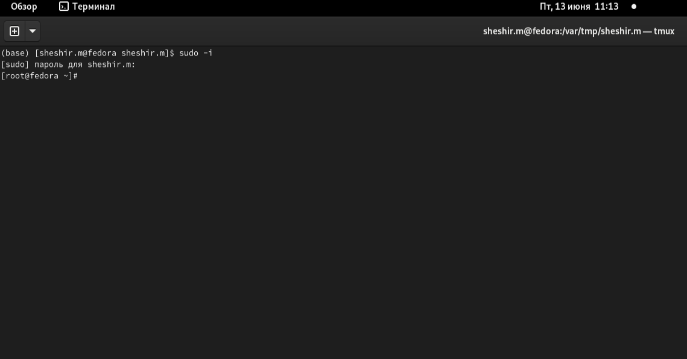
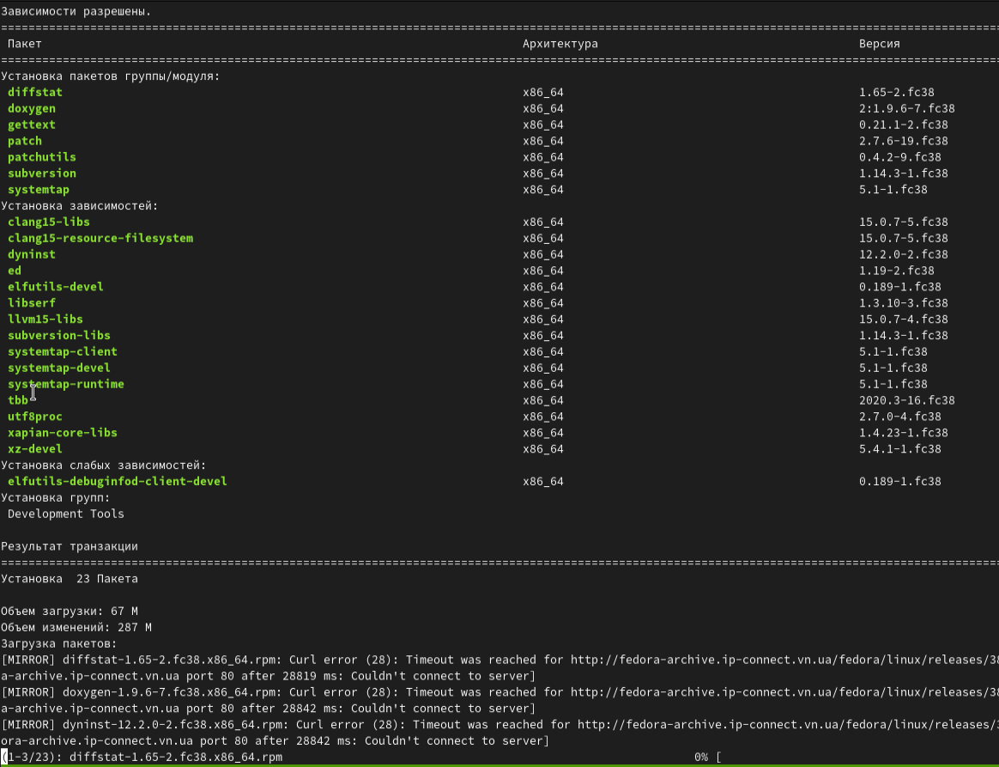
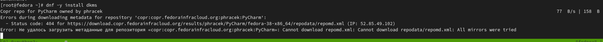
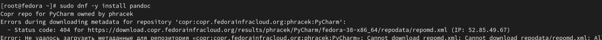

---
## Front matter
lang: ru-RU
title: Презентация лабораторной работы 1
subtitle: отчет
author:
  - Ахмад Мд Шешир.
institute:
  - Российский университет дружбы народов, Москва, Россия
date: 

## i18n babel
babel-lang: russian
babel-otherlangs: english

## Formatting pdf
toc: false
toc-title: Содержание
slide_level: 2
aspectratio: 169
section-titles: true
theme: metropolis
header-includes:
 - \metroset{progressbar=frametitle,sectionpage=progressbar,numbering=fraction}
---

# Информация

## Докладчик

:::::::::::::: {.columns align=center}
::: {.column width="70%"}

  * Ахмад Мд Шешир
  * Cтудент
  * Российский университет дружбы народов

:::
::: {.column width="30%"}

# Цель работы

::: incremental

Целью данной работы является приобретение практических навыков установки операционной системы на виртуальную машину, настройки минимально необходимых для дальнейшей работы сервисов.

:::

## Выполнение лабораторной работы 1

::: incremental

Устанавливаю виртуальную машину и запускаю терминал, вхожу в режим администратора для установки инструментов

:::

## 2 вывод данных

::: incremental

Устанавливаю средства разработки:

:::

## 3 Перенос данных

::: incremental

Установка пакета DKMS:

:::

## 4 лишение прав

::: incremental

устанавливаю пакеиы для работы с языком разметки Markdown 

:::

## вывод

::: incremental

 Входе лабораторной работы я ознакомился с установкой операционной системы linux на виртуальную машину, настроил минимально необходимые для дальнейшей работы сервисы.
 
:::

