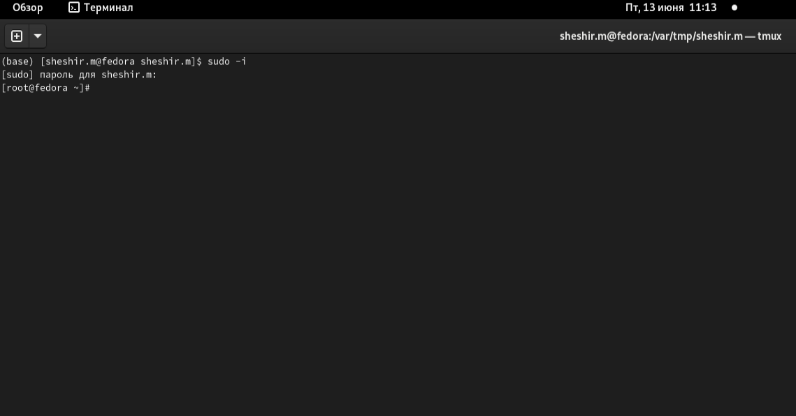
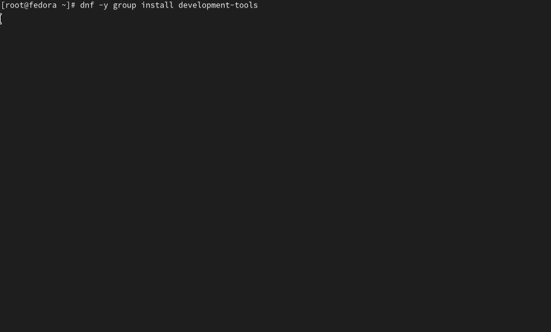
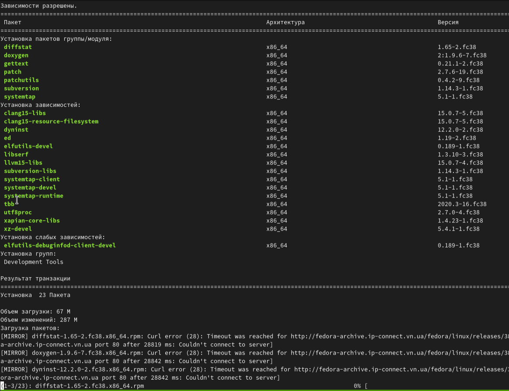
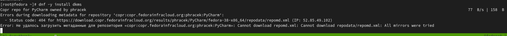
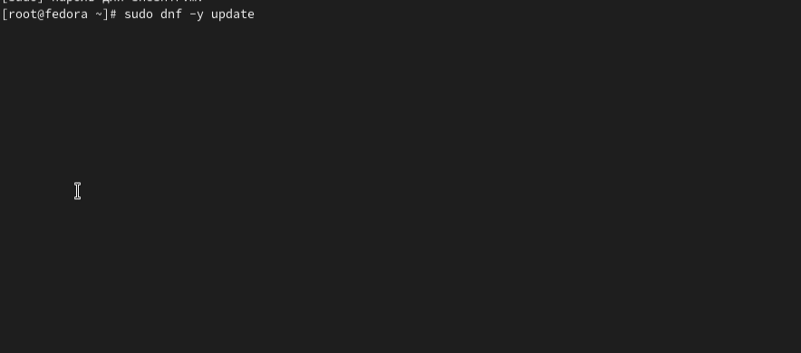
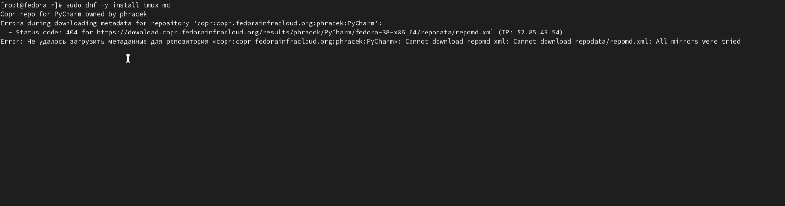
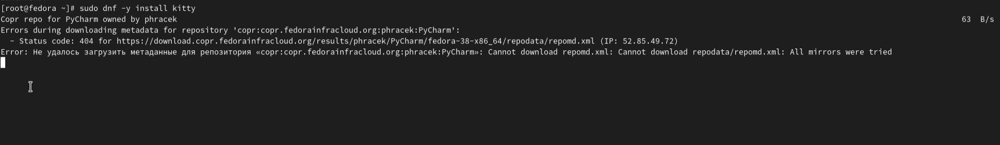
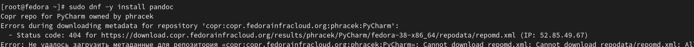
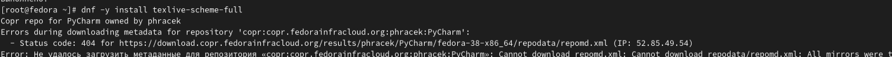

---
## Front matter
title: "Отчёт по лабораторной работе № 1"
subtitle: "Простейший вариант"
author: "Ахмад Мд Шешир"

## Generic otions
lang: ru-RU
toc-title: "Содержание"

## Bibliography
bibliography: bib/cite.bib
csl: pandoc/csl/gost-r-7-0-5-2008-numeric.csl

## Pdf output format
toc: true # Table of contents
toc-depth: 2
lof: true # List of figures
fontsize: 12pt
linestretch: 1.5
papersize: a4
documentclass: scrreprt
## I18n polyglossia
polyglossia-lang:
  name: russian
  options:
	- spelling=modern
	- babelshorthands=true
polyglossia-otherlangs:
  name: english
## I18n babel
babel-lang: russian
babel-otherlangs: english
## Fonts
mainfont: PT Serif
romanfont: PT Serif
sansfont: PT Sans
monofont: PT Mono
mainfontoptions: Ligatures=TeX
romanfontoptions: Ligatures=TeX
sansfontoptions: Ligatures=TeX,Scale=MatchLowercase
monofontoptions: Scale=MatchLowercase,Scale=0.9
## Biblatex
biblatex: true
biblio-style: "gost-numeric"
biblatexoptions:
  - parentracker=true
  - backend=biber
  - hyperref=auto
  - language=auto
  - autolang=other*
  - citestyle=gost-numeric
## Pandoc-crossref LaTeX customization
figureTitle: "Рис."
listingTitle: "Листинг"
lofTitle: "Список иллюстраций"
lolTitle: "Листинги"
## Misc options
indent: true
header-includes:
  - \usepackage{indentfirst}
  - \usepackage{float} # keep figures where there are in the text
  - \floatplacement{figure}{H} # keep figures where there are in the text
---

# Цель работы

Целью данной работы является приобретение практических навыков установки операционной системы на виртуальную машину, настройки минимально необходимых для дальнейшей работы сервисов.

***

# Выполнение лабораторной работы

 **1**
Устанавливаю виртуальную машину и запускаю терминал, вхожу в режим администратора для установки инструментов(рис. [-@fig:001])

{  #fig:001 width=70%  }

 **2**

Устанавливаю средства разработки:(рис. [-@fig:002])

{  #fig:002 width=70%  }

{ width=70%  }

 **3**
Установка пакета DKMS:
(рис. [-@fig:003])

{ #fig:003 width=70% }

 **4**
Обновляю все пакеты(рис. [-@fig:004])

{ #fig:004 width=70% }

 **5**
Устанавливаю Программу для удобства работы в консоли: (рис. [-@fig:005])

{ #fig:005 width=70% }

 **6**
Другой вариант консоли:(рис. [-@fig:006])

{ #fig:006 width=70% }

 **7**
устанавливаю пакеиы для работы с языком разметки Markdown (рис. [-@fig:007])

{ #fig:007 width=70% }

 **8**
Установка пакетов texlive (рис. [-@fig:008])

{ #fig:008 width=70% }

# Вывод

 Входе лабораторной работы я ознакомился с файловой системой Linux, её структурой, именами и содержанием каталогов. Приобрел практические навыки по применению команд для работы с файлами и каталогами.
