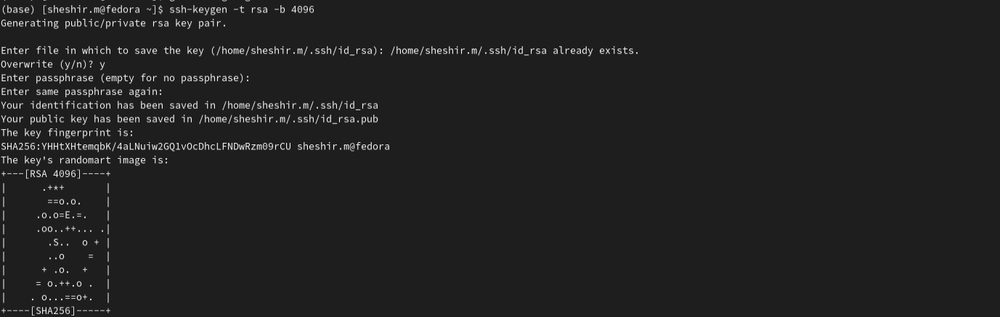

---
## Front matter
lang: ru-RU
title: Презентация отчета по лабораторной работе 2
subtitle: Простейший шаблон
author:
  - Ахмад Мд Шешир.
institute:
  - Российский университет дружбы народов, Москва, Россия
date: 

## i18n babel
babel-lang: russian
babel-otherlangs: english

## Formatting pdf
toc: false
toc-title: Содержание
slide_level: 2
aspectratio: 169
section-titles: true
theme: metropolis
header-includes:
 - \metroset{progressbar=frametitle,sectionpage=progressbar,numbering=fraction}
---

# Информация

## Докладчик

:::::::::::::: {.columns align=center}
::: {.column width="70%"}

  * Ахмад Мд Шешир
  * Cтудент
  * Российский университет дружбы народов

:::
::: {.column width="30%"}

# Цель работы

::: incremental

Изучить идеологию и применение средств контроля версий.
Освоить умения по работе с git.

:::

## Выполнение лабораторной работы 2

::: incremental

Установка git 

:::

## 2 вывод данных

::: incremental

Зададим имя и email владельца репозитория:

:::

## 3 

::: incremental

Создайте ключи ssh и вставляем ее в на сайте гитхаб

:::

## 4 

::: incremental

проверяю есть ли доступ к серверу и отправляю файлы на сервер:

:::

## вывод

::: incremental

 Входе лабораторной работы я ознакомился с идеологией и применением средств контроля версий и Освоил умения по работе с git.

 
:::

