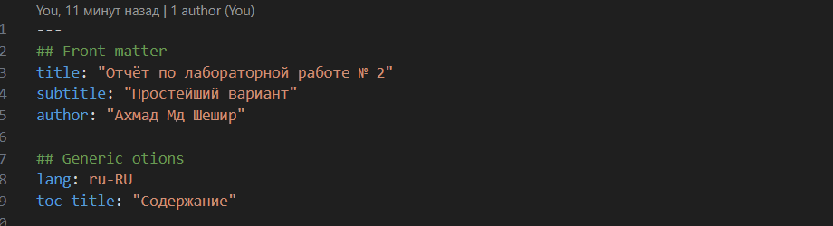
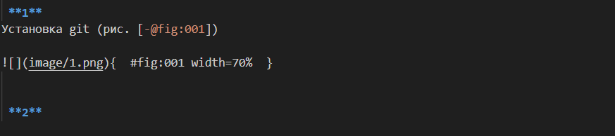
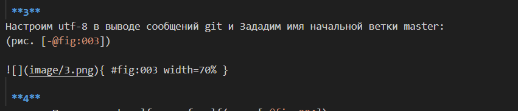
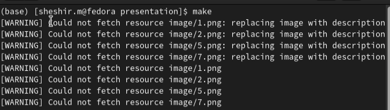

---
## Front matter
lang: ru-RU
title: Презентация отчёта по лабораторной работе № 3
subtitle: Простейший шаблон
author:
  - Ахмад Мд Шешир.
institute:
  - Российский университет дружбы народов, Москва, Россия
date: 

## i18n babel
babel-lang: russian
babel-otherlangs: english

## Formatting pdf
toc: false
toc-title: Содержание
slide_level: 2
aspectratio: 169
section-titles: true
theme: metropolis
header-includes:
 - \metroset{progressbar=frametitle,sectionpage=progressbar,numbering=fraction}
---

## Докладчик

:::::::::::::: {.columns align=center}
::: {.column width="70%"}

  * Ахмад Мд Шешир
  * Cтудент
  * Российский университет дружбы народов

:::
::: {.column width="30%"}

# Цель работы

::: incremental

Научиться оформлять отчёты с помощью легковесного языка разметки Markdown

:::

## Выполнение лабораторной работы 3

::: incremental

Открываю файл report.md и пишу в заголовке свое ФИО 

:::

## 2 

::: incremental

Делю лаборатрную работу на пункты и пишу то, что я делаю

:::

## 3 

::: incremental

вставляю путь к изображениям в папке image и пишу ссылки и комментарии к картинкам

:::

## 4 

::: incremental

Открываю терминал и создаю doc, pdf файлы для отчета

:::

## вывод

::: incremental

 Входе лабораторной работы я Научился оформлять отчёты с помощью легковесного языка разметки Markdown
 
:::

