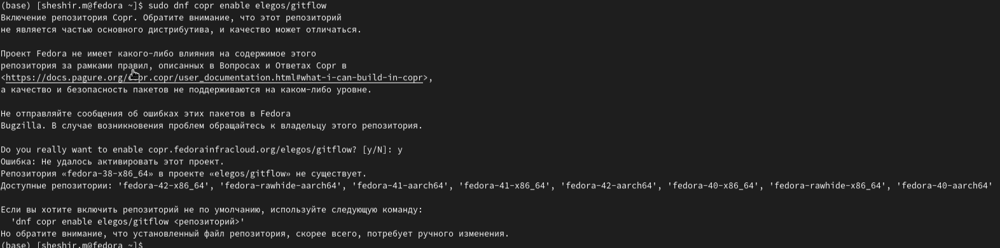
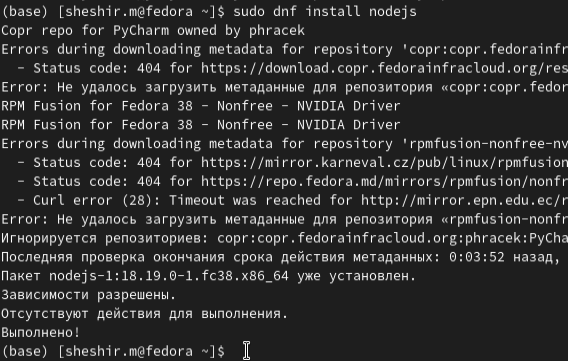
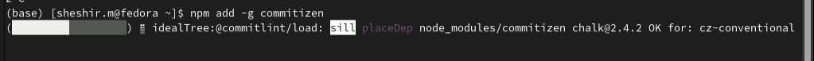
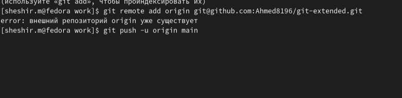

---
## Front matter
lang: ru-RU
title: Презентация отчёта по лабораторной работе № 4
subtitle: Простейший шаблон
author:
  - Ахмад Мд Шешир.
institute:
  - Российский университет дружбы народов, Москва, Россия
date: 

## i18n babel
babel-lang: russian
babel-otherlangs: english

## Formatting pdf
toc: false
toc-title: Содержание
slide_level: 2
aspectratio: 169
section-titles: true
theme: metropolis
header-includes:
 - \metroset{progressbar=frametitle,sectionpage=progressbar,numbering=fraction}
---
# Информация

## Докладчик

:::::::::::::: {.columns align=center}
::: {.column width="70%"}

  * НММ-03-23
  * студент
  * Российский университет дружбы народов
  * <https://github.com/dimaarfonos/study_2022-2023_os-intro/tree/master/labs>

:::
::: {.column width="30%"}

# 
-  Цель работы

Получение навыков правильной работы с репозиториями Github в среде операционной системы Linux.

:::
::::::::::::::

:::
::: {.column width="30%"}

# Выполнение лабораторной работы

Установка git-flow

:::
::: {.column width="30%"}

#
Установка Node.js

:::
::: {.column width="30%"}

#
Общепринятые коммиты для помощи в форматировании коммитов.

:::
::: {.column width="30%"}

#
Создаем репозиторий на GitHub. Для примера назовём его git-extended. 

:::
::: {.column width="30%"}

#
Делаем первый коммит и выкладываем на github:

:::
::: {.column width="30%"}

# 
- Вывод

 Входе лабораторной работы я получил навыки правильной работы с репозиториями git с  в терминале операционной системы OC Linux Fedora.

:::
::: {.column width="30%"}