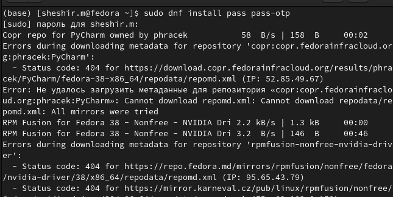
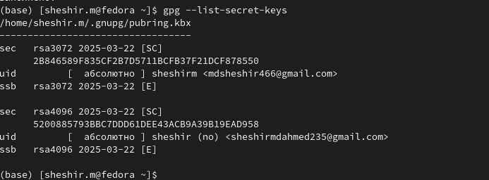
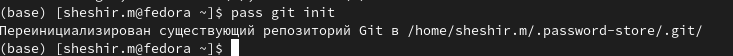
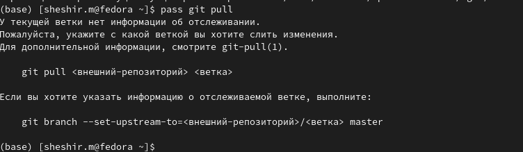
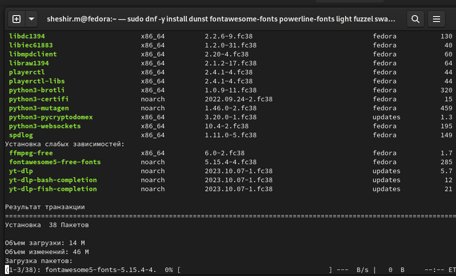
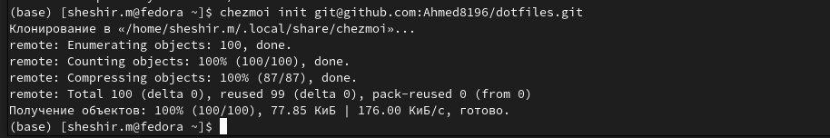
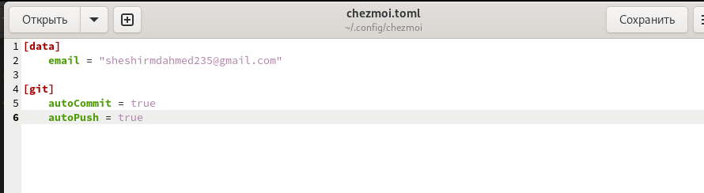

---
## Front matter
lang: ru-RU
title: Презентация отчёта по лабораторной работе № 3
subtitle: Простейший шаблон
author:
  - Ахмад Мд Шешир.
institute:
  - Российский университет дружбы народов, Москва, Россия
date: 

## i18n babel
babel-lang: russian
babel-otherlangs: english

## Formatting pdf
toc: false
toc-title: Содержание
slide_level: 2
aspectratio: 169
section-titles: true
theme: metropolis
header-includes:
 - \metroset{progressbar=frametitle,sectionpage=progressbar,numbering=fraction}
---
# Информация

## Докладчик

:::::::::::::: {.columns align=center}
::: {.column width="70%"}

  * Арфонос Дмитрий
  * НММ-03-23
  * студент
  * Российский университет дружбы народов
  * <https://github.com/dimaarfonos/study_2022-2023_os-intro/tree/master/labs>

:::
::: {.column width="30%"}

# 
-  Цель работы

Получение навыков правильной работы с репозиториями Github в среде операционной системы Linux.

:::
::::::::::::::

:::
::: {.column width="30%"}

# Выполнение лабораторной работы

Устанавливаю  Менеджер паролей pass 

:::
::: {.column width="30%"}

#
Просмотр списка ключей:

:::
::: {.column width="30%"}

#
Создадим структуру git:

:::
::: {.column width="30%"}

#
Cинхронизация с сервером git:

:::
::: {.column width="30%"}

#
Установим дополнительное программное обеспечение:

:::
::: {.column width="30%"}

#

Создадим собственный репозитория с помощью утилит

:::
::: {.column width="30%"}

#
Подключим репозиторий к своей системе 

:::
::: {.column width="30%"}

#
Автоматизация фиксаций и push изменений в репозиторий

# 
- Вывод

 Входе лабораторной работы я получил навыки правильной работы с репозиториями git с использованием менеджера паролей и автоматической фиксацией и отправкой изменений в репозиторий в терминале операционной системы OC Linux Fedora.

:::
::: {.column width="30%"}