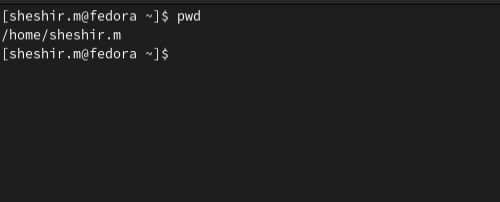
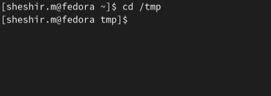
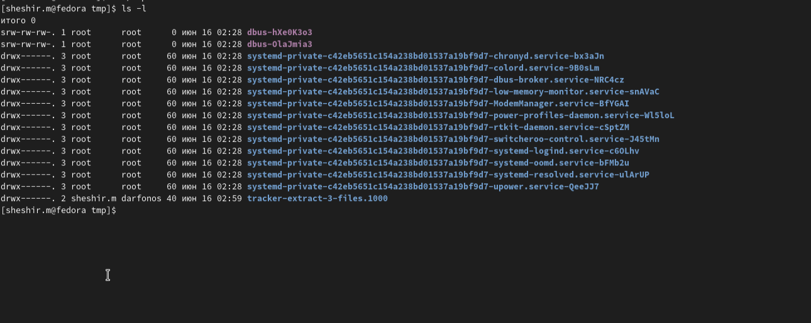
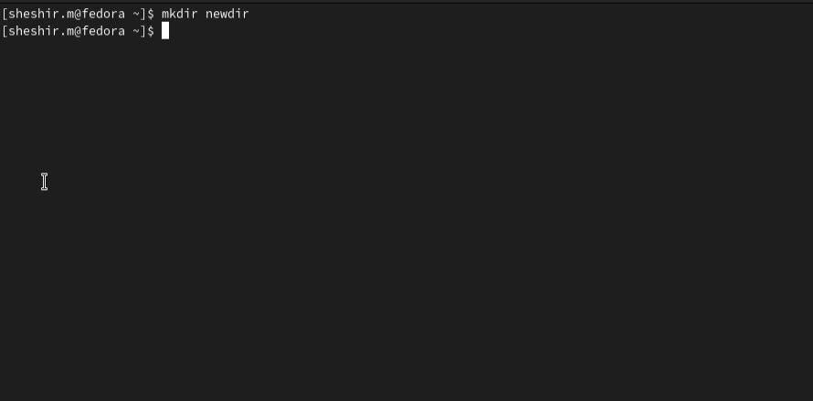

---
## Front matter
lang: ru-RU
title: Структура научной презентации
subtitle: Лабораторная работа намер 6
author:
  - Ахмад Мд Шешир
institute:
  - Российский университет дружбы народов, Москва, Россия
date: 9 марта 2025

## i18n babel
babel-lang: russian
babel-otherlangs: english

## Formatting pdf
toc: false
toc-title: Содержание
slide_level: 2
aspectratio: 169
section-titles: true
theme: metropolis
header-includes:
 - \metroset{progressbar=frametitle,sectionpage=progressbar,numbering=fraction}
 - '\makeatletter'
 - '\beamer@ignorenonframefalse'
 - '\makeatother'
---

# Информация

## Докладчик

:::::::::::::: {.columns align=center}
::: {.column width="70%"}

  * Ахмад Мд Шешир
  * студент
  * Российский университет дружбы народов

:::
::: {.column width="30%"}

# 
-  Цель работы

:::

Приобретение практических навыков взаимодействия пользователя с системой посредством командной строки.

:::
::::::::::::::

:::
::: {.column width="30%"}

# 
Выполнение лабораторной работы

##
Определите полное имя своего домашнего каталога.

::: incremental

{}

::: incremental

#
Перейду в каталог /tmp .

{}

::: incremental

##
Вывожу на экран содержимое каталога /tmp. Для этого использую команду ls
.

::: incremental

##

В домашнем каталоге создаю новый каталог с именем newdir
.

::: incremental

# Вывод

::: incremental

 Входе лабораторной работы я получил навыки взаимодействия пользователя с системой посредством командной строки.

 :::