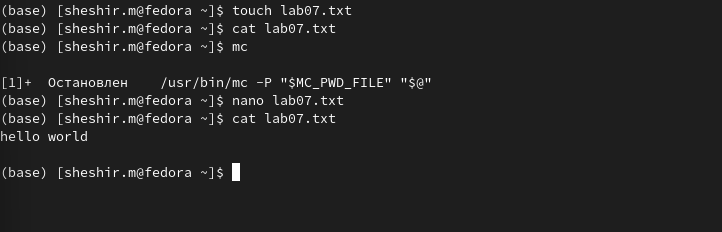
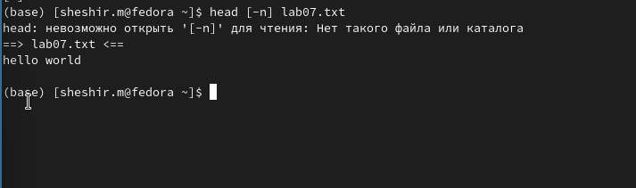
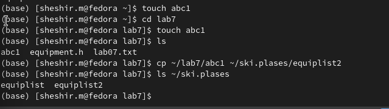

---
## Front matter
lang: ru-RU
title: Структура научной презентации
subtitle: Простейший шаблон
author:
  - Ахмад Мд Шешир.
institute:
  - Российский университет дружбы народов, Москва, Россия
date: 

## i18n babel
babel-lang: russian
babel-otherlangs: english

## Formatting pdf
toc: false
toc-title: Содержание
slide_level: 2
aspectratio: 169
section-titles: true
theme: metropolis
header-includes:
 - \metroset{progressbar=frametitle,sectionpage=progressbar,numbering=fraction}
---

# Информация

## Докладчик

:::::::::::::: {.columns align=center}
::: {.column width="70%"}

  * Ахмад Мд Шешир
  * Cтудент
  * Российский университет дружбы народов

:::
::: {.column width="30%"}

# Цель работы

::: incremental

Ознакомление с файловой системой Linux, её структурой, именами и содержанием
каталогов. Приобретение практических навыков по применению команд для работы
с файлами и каталогами, по управлению процессами (и работами), по проверке использования диска и обслуживанию файловой системы.

:::

## Выполнение лабораторной работы 1

::: incremental

Создаю текстовой файл с командой touch и смотрю содержимое.

:::

## 2 вывод данных

::: incremental

Команда head выводит по умолчанию первые 10 строк файла

:::

## 3 Перенос данных

::: incremental

Создаю в домашнем каталоге файл abc1 и скопирую его в каталог
~/ski.plases, назову его equiplist2.

:::

## 4 лишение прав

::: incremental

Лишаю владельца файла ~/feathers права на чтение.

:::

## вывод

::: incremental

 Входе лабораторной работы я ознакомился с файловой системой Linux, её структурой, именами и содержанием каталогов. Приобрел практические навыки по применению команд для работы с файлами и каталогами.
 
:::

