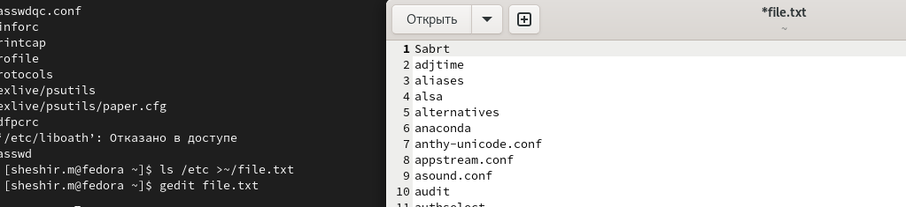
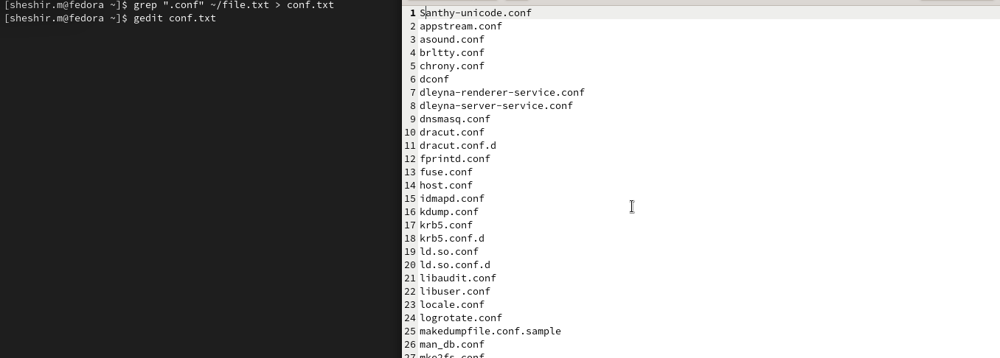
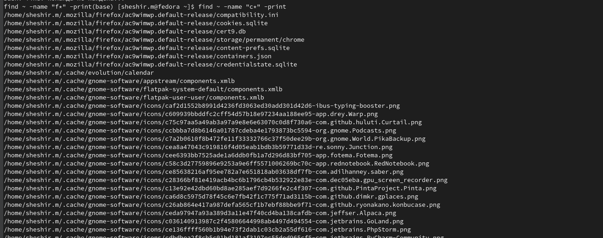
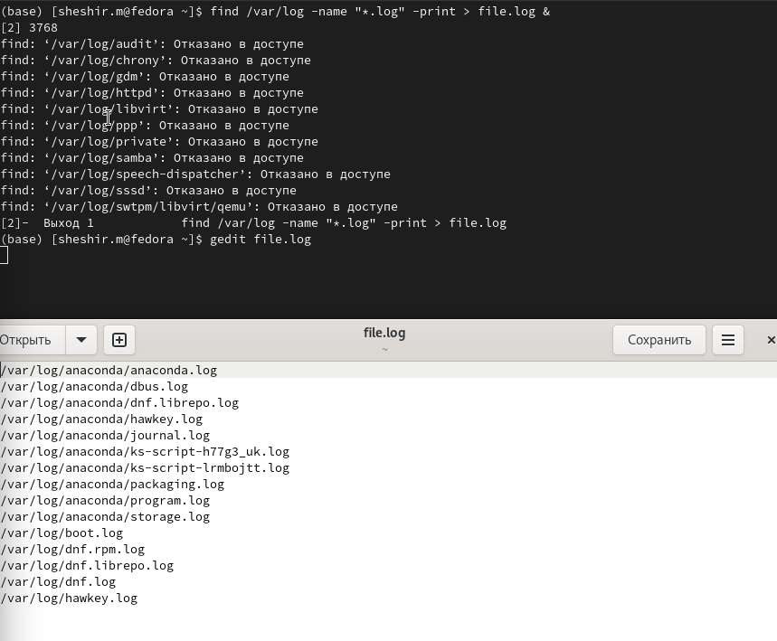

---
## Front matter
lang: ru-RU
title: Структура научной презентации
subtitle: Презентация лабораторной работы № 8
author:
  - Ахмад Мд Шешир.
institute:
  - Российский университет дружбы народов, Москва, Россия
date: 

## i18n babel
babel-lang: russian
babel-otherlangs: english

## Formatting pdf
toc: false
toc-title: Содержание
slide_level: 2
aspectratio: 169
section-titles: true
theme: metropolis
header-includes:
 - \metroset{progressbar=frametitle,sectionpage=progressbar,numbering=fraction}
---

## Докладчик

:::::::::::::: {.columns align=center}
::: {.column width="70%"}

  * Ахмад Мд Шешир
  * Cтудент
  * Российский университет дружбы народов

:::
::: {.column width="30%"}

# Цель работы

::: incremental

Ознакомление с инструментами поиска файлов и фильтрации текстовых данных.
Приобретение практических навыков: по управлению процессами (и заданиями), по
проверке использования диска и обслуживанию файловых систем

:::

## Выполнение лабораторной работы 8

::: incremental

Записываю в файл file.txt названия файлов, содержащихся в каталоге /etc

:::

## 2 вывод имен в файл

::: incremental

Вывожу имена всех файлов из file.txt, имеющих расширение .conf  записываю их в новый текстовой файл conf.txt.

:::

## 3 определение файлов в катологе

::: incremental

Определяю, какие файлы в вашем домашнем каталоге имеют имена, начинавшиеся с символа c 

:::

## 4 фоновый режим

::: incremental

Запустил в фоновом режиме процесс, который будет записывать в файл ~/logfile файлы, имена которых начинаются с log.

:::

## 5 Определение идентификатора

::: incremental

Запустил в фоновом режиме процесс, который будет записывать в файл ~/logfile файлы, имена которых начинаются с log.

:::

## 6 информация по работе с df и du

::: incremental

Выполняю команды df и du, предварительно получив более подробную информацию об этих командах, с помощью команды man.

:::

## вывод

::: incremental

В ходе работы я ознакомился с инструментами поиска файлов и фильтрации текстовых данных.
 
:::

