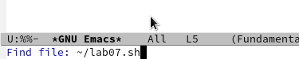

---
## Front matter
lang: ru-RU
title: Структура научной презентации
subtitle: Презентация лабораторной работы № 9
author:
  - Ахмад Мд Шешир.
institute:
  - Российский университет дружбы народов, Москва, Россия
date: 

## i18n babel
babel-lang: russian
babel-otherlangs: english

## Formatting pdf
toc: false
toc-title: Содержание
slide_level: 2
aspectratio: 169
section-titles: true
theme: metropolis
header-includes:
 - \metroset{progressbar=frametitle,sectionpage=progressbar,numbering=fraction}
---

## Докладчик

:::::::::::::: {.columns align=center}
::: {.column width="70%"}

  * Ахмад Мд Шешир
  * Cтудент
  * Российский университет дружбы народов

:::
::: {.column width="30%"}

# Цель работы

::: incremental

Познакомиться с операционной системой Linux. Получить практические навыки работы с редактором Emacs.

:::

## Выполнение лабораторной работы 9

::: incremental

. Открою emacs и создаю файл lab07.sh с помощью комбинации Ctrl-x Ctrl-f (рис. [-@fig:001]).

{#fig:001 width=70%}

:::

## 2

::: incremental

Набераю текст из лаборатрной:(рис. [-@fig:002]).

{#fig:002 width=70%}

:::

## 3 

::: incremental

Делю фрейм на 4 части: разделите фрейм на два окна по вертикали (C-x 3),
а затем каждое из этих окон на две части по горизонтали (рис. [-@fig:011]).

{#fig:011 width=70%}

:::

## вывод

::: incremental

В ходе работы я 
Познакомился с операционной системой Linux. Получить практические навыки работы с редактором Emacs.

:::

