---
## Front matter
title: "Oтчёт по лабораторной работе 11"
subtitle: "Простейший вариант"
author: "Ахмад Мд Шешир"

## Generic otions
lang: ru-RU
toc-title: "Содержание"

## Bibliography
bibliography: bib/cite.bib
csl: pandoc/csl/gost-r-7-0-5-2008-numeric.csl

## Pdf output format
toc: true # Table of contents
toc-depth: 2
lof: true # List of figures
lot: true # List of tables
fontsize: 12pt
linestretch: 1.5
papersize: a4
documentclass: scrreprt
## I18n polyglossia
polyglossia-lang:
  name: russian
  options:
	- spelling=modern
	- babelshorthands=true
polyglossia-otherlangs:
  name: english
## I18n babel
babel-lang: russian
babel-otherlangs: english
## Fonts
mainfont: IBM Plex Serif
romanfont: IBM Plex Serif
sansfont: IBM Plex Sans
monofont: IBM Plex Mono
mathfont: STIX Two Math
mainfontoptions: Ligatures=Common,Ligatures=TeX,Scale=0.94
romanfontoptions: Ligatures=Common,Ligatures=TeX,Scale=0.94
sansfontoptions: Ligatures=Common,Ligatures=TeX,Scale=MatchLowercase,Scale=0.94
monofontoptions: Scale=MatchLowercase,Scale=0.94,FakeStretch=0.9
mathfontoptions:
## Biblatex
biblatex: true
biblio-style: "gost-numeric"
biblatexoptions:
  - parentracker=true
  - backend=biber
  - hyperref=auto
  - language=auto
  - autolang=other*
  - citestyle=gost-numeric
## Pandoc-crossref LaTeX customization
figureTitle: "Рис."
tableTitle: "Таблица"
listingTitle: "Листинг"
lofTitle: "Список иллюстраций"
lotTitle: "Список таблиц"
lolTitle: "Листинги"
## Misc options
indent: true
header-includes:
  - \usepackage{indentfirst}
  - \usepackage{float} # keep figures where there are in the text
  - \floatplacement{figure}{H} # keep figures where there are in the text
---

# Цель работы

Познакомиться с операционной системой Linux. Получить практические навыки работы с редактором Emacs.

# Задание

1. Ознакомиться с теоретическим материалом.
2. Ознакомиться с редактором emacs.
3. Выполнить упражнения.
4. Ответить на контрольные вопросы.

# Выполнение лабораторной работы

1. Открою emacs и создаю файл lab07.sh с помощью комбинации Ctrl-x Ctrl-f (рис. [-@fig:001]).

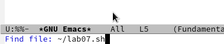{#fig:001 width=70%}

2. Набераю текст из лаборатрной:(рис. [-@fig:002]).

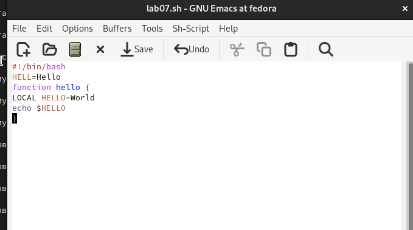{#fig:002 width=70%}

3. Сохраняю файл с помощью комбинации Ctrl-x Ctrl-s (рис. [-@fig:004]).

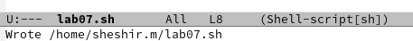{#fig:004 width=70%}

4. Проделать с текстом стандартные процедуры редактирования: Выделияю область текста (рис. [-@fig:005]).

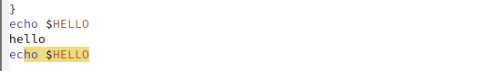{#fig:005 width=70%}

5. Научился использовать команды по перемещению курсора.
6.1. Перемещать курсор в начало строки (C-a).
6.2. Перемещать курсор в конец строки (C-e).
6.3. Перемещать курсор в начало буфера (M-<).
6.4. Перемещать курсор в конец буфера (M->).(рис. [-@fig:006]).

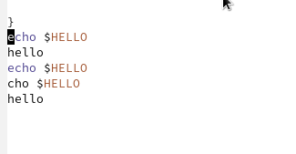{#fig:006 width=70%}

6. Вывожу список активных буферов на экран (C-x C-b). (рис. [-@fig:007]).

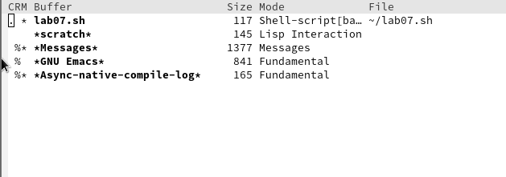{#fig:007 width=70%}

7.  Перемещаюсь во вновь открытое окно (C-x) o со списком открытых буферов
и переключитесь на другой буфер.
(рис. [-@fig:008]).

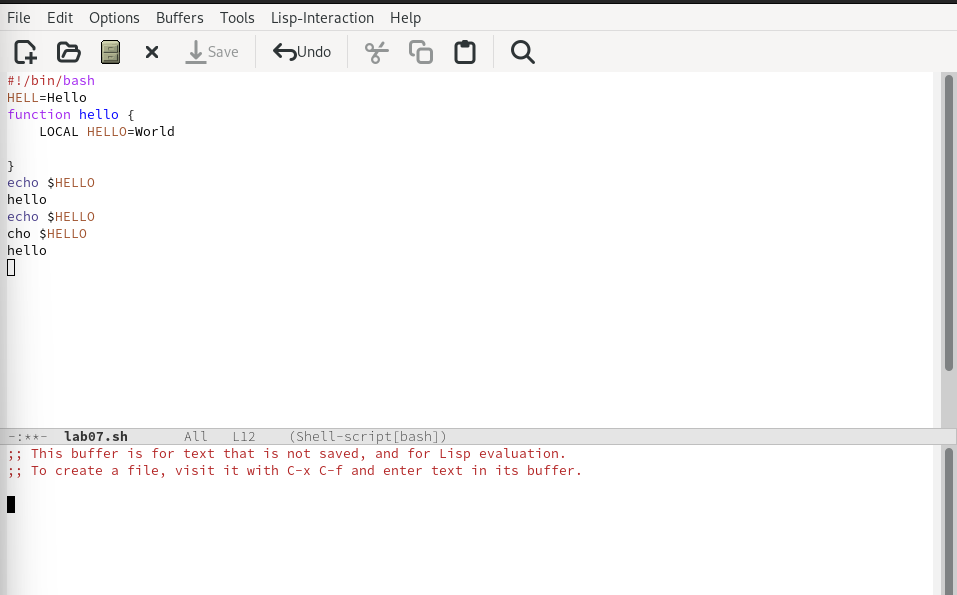{#fig:008 width=70%}

8.  Закрываю окно (рис. [-@fig:009]).

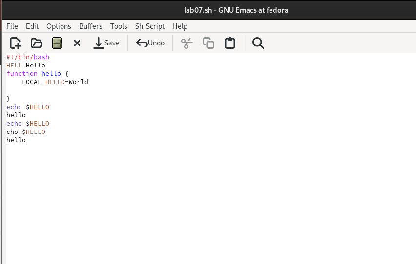{#fig:009 width=70%}

9.  Теперь вновь переключаюсь между буферами, но уже без вывода их списка на экран (C-x b) (рис. [-@fig:010]).

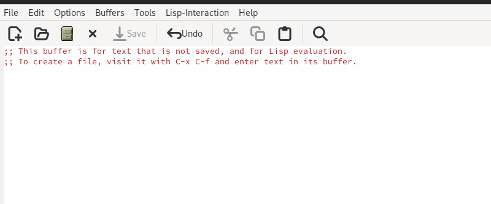{#fig:010 width=70%}

10. Делю фрейм на 4 части: разделите фрейм на два окна по вертикали (C-x 3),
а затем каждое из этих окон на две части по горизонтали (рис. [-@fig:011]).

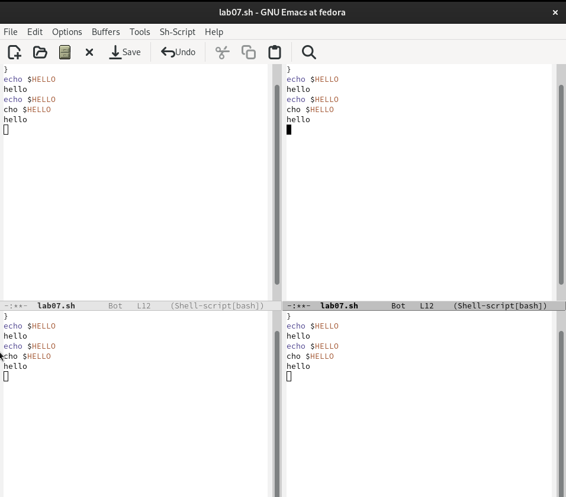{#fig:011 width=70%}

11. В каждом из четырёх созданных окон открыл новый буфер (файл) и введите несколько строк текста (рис. [-@fig:0012]).

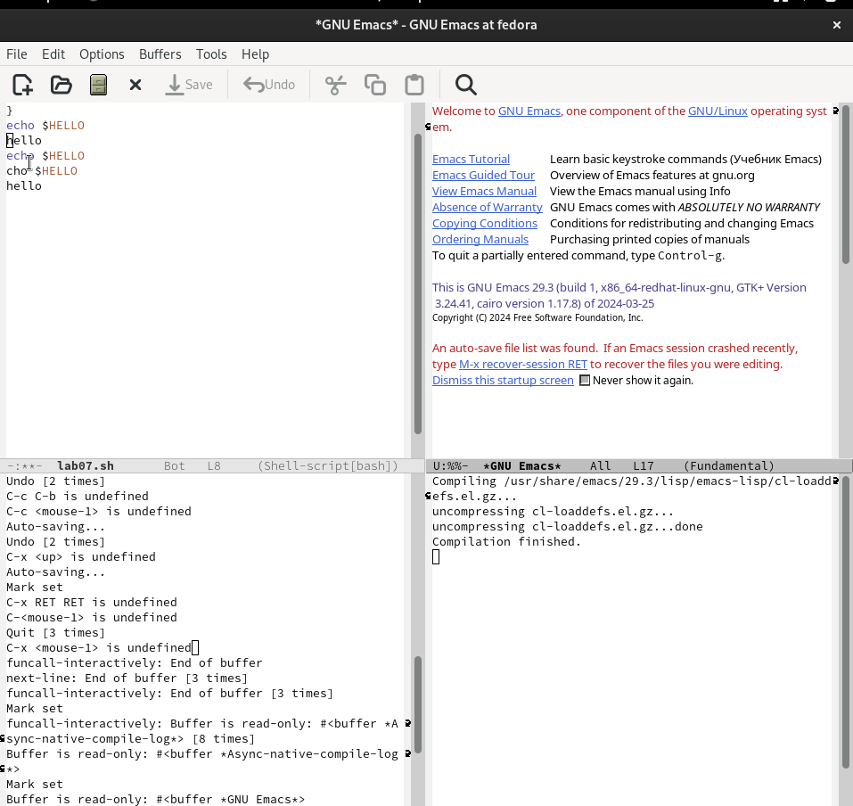{#fig:0012 width=70%}

12. Переключаюсь в режим поиска (C-s) и найдите несколько слов, присутствующих
в тексте (рис. [-@fig:013]).

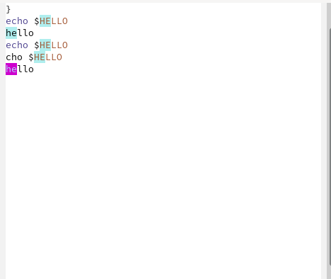{#fig:013 width=70%}

13. Переключаюсь между результатами поиска, нажимая C-s(рис. [-@fig:014]).

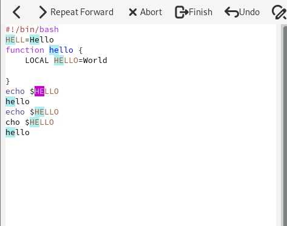{#fig:014 width=70%}

# Выводы

В ходе работы я 
Познакомился с операционной системой Linux. Получить практические навыки работы с редактором Emacs.

