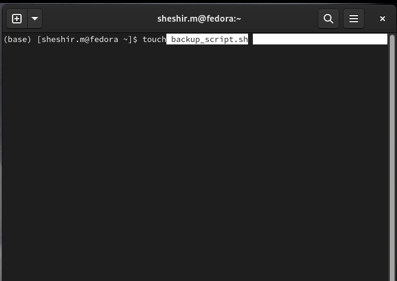
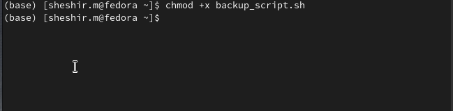
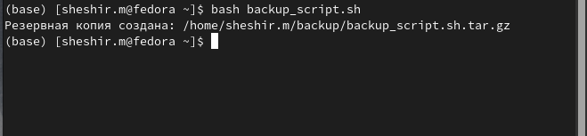
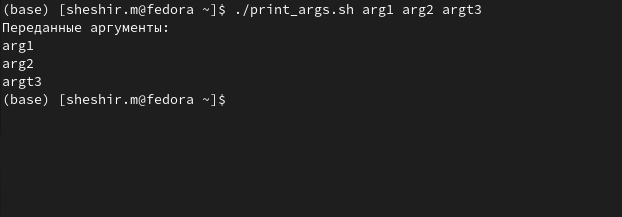

---
## Front matter
lang: ru-RU
title: Структура научной презентации
subtitle: Презентация лабораторной работы № 12
author:
  - Ахмад Мд Шешир.
institute:
  - Российский университет дружбы народов, Москва, Россия
date: 

## i18n babel
babel-lang: russian
babel-otherlangs: english

## Formatting pdf
toc: false
toc-title: Содержание
slide_level: 2
aspectratio: 169
section-titles: true
theme: metropolis
header-includes:
 - \metroset{progressbar=frametitle,sectionpage=progressbar,numbering=fraction}
---

## Докладчик

:::::::::::::: {.columns align=center}
::: {.column width="70%"}

  * Ахмад Мд Шешир
  * Cтудент
  * Российский университет дружбы народов

:::
::: {.column width="30%"}

# Цель работы

::: incremental

Познакомиться с операционной системой Linux. Получить практические навыки работы с редактором Emacs.

:::

## Выполнение лабораторной работы 12

**1**. Написать скрипт, который при запуске будет делать резервную копию самого себя (то
есть файла, в котором содержится его исходный код) в другую директорию backup
в вашем домашнем каталоге. При этом файл должен архивироваться одним из архиваторов на выбор zip, bzip2 или ta

::: incremental

## 1

Набираю программу где создаю переменные с путями для резервной копии .

{}

:::

## 2

::: incremental

Делаю файл исполняемым, выполнив команду в терминале chmod

{#fig:002 width=70%}

:::

## 3 

::: incremental

Запускаю исполняемый файл и проверяю существует ли архив 

{#fig:011 width=70%}

:::

## 4

::: incremental
**Задача 2**
Написать пример командного файла, обрабатывающего любое произвольное число
аргументов командной строки, в том числе превышающее десять. Например, скрипт
может последовательно распечатывать значения всех переданных аргументов.

:::

## 1

Набираю программу где создаю переменные с путями для резервной копии .

{}

:::

## 2

::: incremental

Запускаю исполняемы файл и проверяю работу 

{}

:::

## вывод

::: incremental

В ходе работы я 
Познакомился с операционной системой Linux. Получить практические навыки работы с редактором Emacs.

:::

