---
## Front matter
title: "Oтчёт по лабораторной работе №12"
subtitle: "Простейший вариант"
author: "Ахмад Мд Шешир"

## Generic otions
lang: ru-RU
toc-title: "Содержание"

## Bibliography
bibliography: bib/cite.bib
csl: pandoc/csl/gost-r-7-0-5-2008-numeric.csl

## Pdf output format
toc: true # Table of contents
toc-depth: 2
lof: true # List of figures
lot: true # List of tables
fontsize: 12pt
linestretch: 1.5
papersize: a4
documentclass: scrreprt
## I18n polyglossia
polyglossia-lang:
  name: russian
  options:
	- spelling=modern
	- babelshorthands=true
polyglossia-otherlangs:
  name: english
## I18n babel
babel-lang: russian
babel-otherlangs: english
## Fonts
mainfont: IBM Plex Serif
romanfont: IBM Plex Serif
sansfont: IBM Plex Sans
monofont: IBM Plex Mono
mathfont: STIX Two Math
mainfontoptions: Ligatures=Common,Ligatures=TeX,Scale=0.94
romanfontoptions: Ligatures=Common,Ligatures=TeX,Scale=0.94
sansfontoptions: Ligatures=Common,Ligatures=TeX,Scale=MatchLowercase,Scale=0.94
monofontoptions: Scale=MatchLowercase,Scale=0.94,FakeStretch=0.9
mathfontoptions:
## Biblatex
biblatex: true
biblio-style: "gost-numeric"
biblatexoptions:
  - parentracker=true
  - backend=biber
  - hyperref=auto
  - language=auto
  - autolang=other*
  - citestyle=gost-numeric
## Pandoc-crossref LaTeX customization
figureTitle: "Рис."
tableTitle: "Таблица"
listingTitle: "Листинг"
lofTitle: "Список иллюстраций"
lotTitle: "Список таблиц"
lolTitle: "Листинги"
## Misc options
indent: true
header-includes:
  - \usepackage{indentfirst}
  - \usepackage{float} # keep figures where there are in the text
  - \floatplacement{figure}{H} # keep figures where there are in the text
---

# Цель работы

Изучить основы программирования в оболочке ОС UNIX/Linux. Научиться писать небольшие командные файлы.

# Задания

**1**. Написать скрипт, который при запуске будет делать резервную копию самого себя (то
есть файла, в котором содержится его исходный код) в другую директорию backup
в вашем домашнем каталоге. При этом файл должен архивироваться одним из архиваторов на выбор zip, bzip2 или ta

**2**. Написать пример командного файла, обрабатывающего любое произвольное число
аргументов командной строки, в том числе превышающее десять. Например, скрипт
может последовательно распечатывать значения всех переданных аргументов.

**3**. Написать командный файл — аналог команды ls (без использования самой этой команды и команды dir). Требуется, чтобы он выдавал информацию о нужном каталоге
и выводил информацию о возможностях доступа к файлам этого каталога

**4**. Написать командный файл, который получает в качестве аргумента командной строки
формат файла (.txt, .doc, .jpg, .pdf и т.д.) и вычисляет количество таких файлов
в указанной директории. Путь к директории также передаётся в виде аргумента командной строки

# Выполнение лабораторной работы

## Задача 1

1. Создаю файл backup_script.sh где будет сам скрипт
(рис. [-@fig:001]).

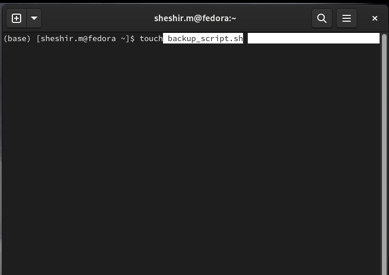{#fig:001 width=70%}

2.  Набираю программу где создаю переменные с путями для резервной копии . (рис. [-@fig:002]).

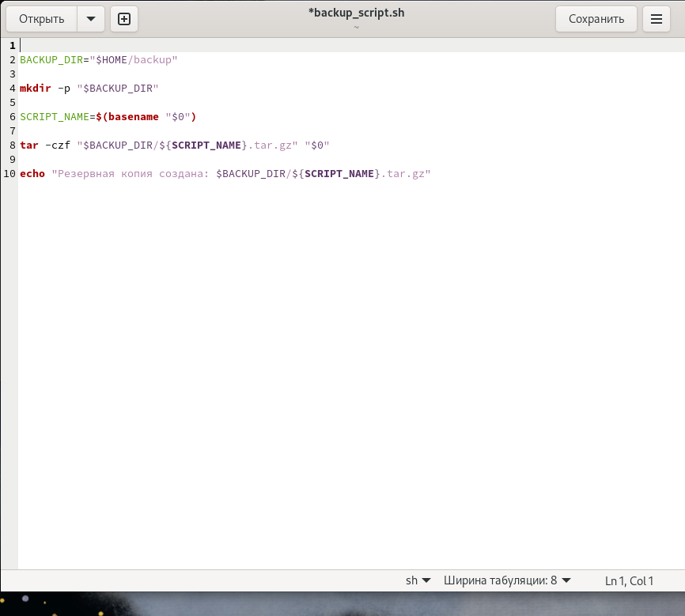{#fig:002 width=70%}

3. Делаю файл исполняемым, выполнив команду в терминале chmod (рис. [-@fig:004]).

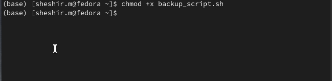{#fig:004 width=70%}

4. Запускаю исполняемый файл и проверяю существует ли архив  (рис. [-@fig:005]).

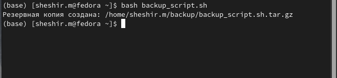{#fig:005 width=70%}

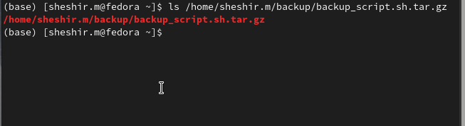{ width=70%}

## Задача 2

1. Открываю текстовый редактор и создайте новый файл print_args.sh (рис. [-@fig:006]).

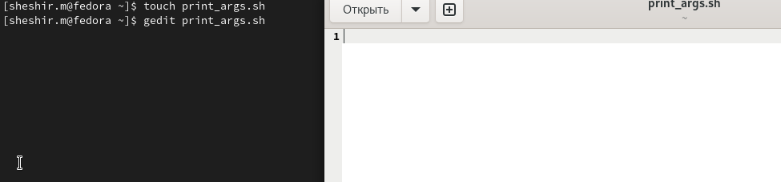{#fig:006 width=70%}

2. Набираю программу которая будет сначала проверять переданы ли аргументы, а если переданы будет их перебирать с помощью цикла for и выводить (рис. [-@fig:007]).

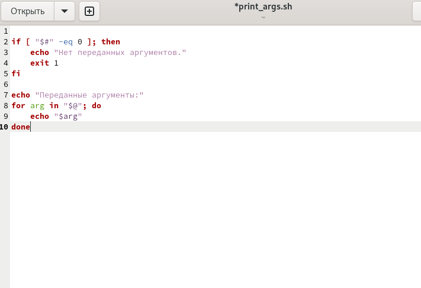{#fig:007 width=70%}

3. Делаю файл исполняемым, выполнив команду в терминале chmod .(рис. [-@fig:008]).

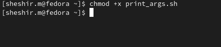{#fig:008 width=70%}

4. Запускаю исполняемы файл и проверяю работу (рис. [-@fig:009]).

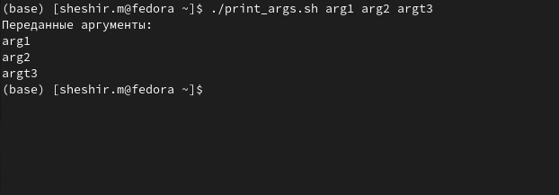{#fig:009 width=70%}

## Задача 3 

1. Открываю редактор gedit и создаю новый файл my_ls.sh  (рис. [-@fig:010]).

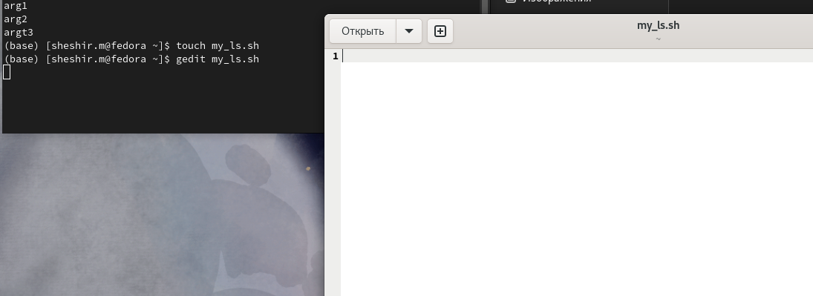{#fig:010 width=70%}

2. Пишу программу которая будет проверять существование переданного каталога, и вывода всего его содержимого. (рис. [-@fig:011]).

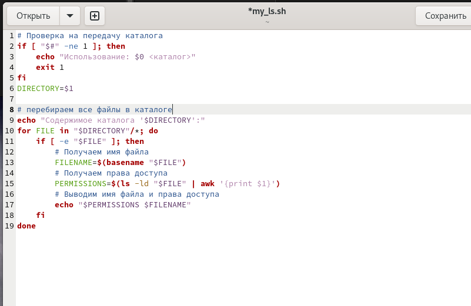{#fig:011 width=70%}

3. Делаю файл исполняемым, выполнив команду в терминале chmod  (рис. [-@fig:0012]).

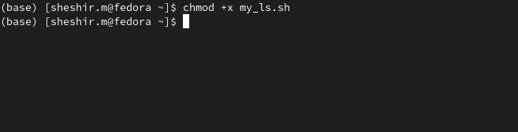{#fig:0012 width=70%}

4. Запускаю исполняемы файл, передаю ей в качестве аргумента путь до нужной директории. Проверяю работу (рис. [-@fig:013]).

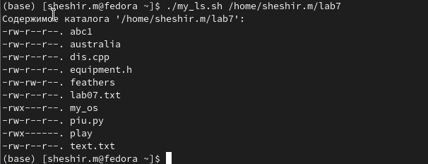{#fig:013 width=70%}

## Задача 4

1. Открываю редактор gedit и создаю новый файл count_files.sh  (рис. [-@fig:014]).

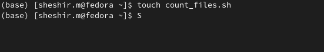{#fig:014 width=70%}

2. Пишу программу которая будет проверять существование переданного каталога, и вывода всего его содержимого. (рис. [-@fig:015]).

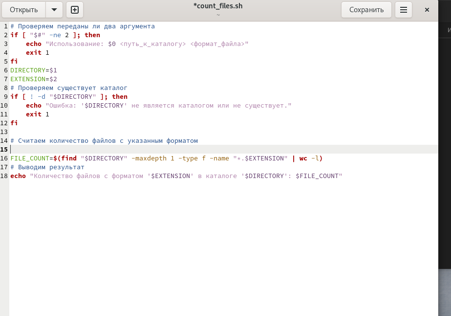{#fig:015 width=70%}

3. Делаю файл исполняемым, выполнив команду в терминале chmod  (рис. [-@fig:0016]).

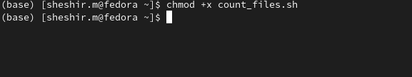{#fig:0016 width=70%}

4. Запускаю исполняемы файл, передаю ей в качестве аргумента путь до нужной директории и формал файла (png, txt doc и тд). Проверяю работу (рис. [-@fig:017]).

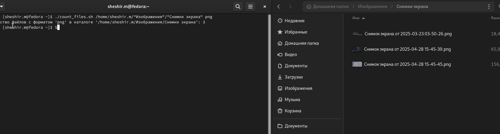{#fig:017 width=70%}

# Выводы

В ходе работы я познакомился с основами программирования в оболочке ОС UNIX/Linux. Научился писать
небольшие командные файлы.

