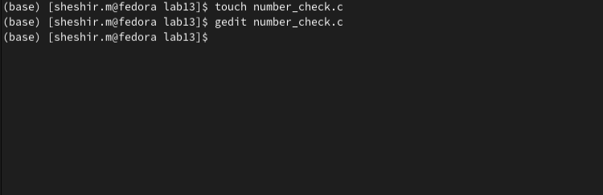
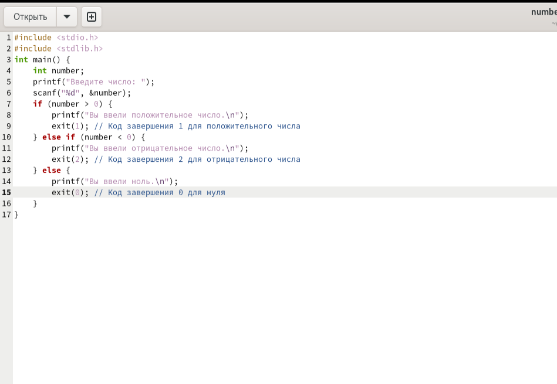
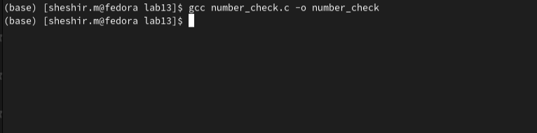
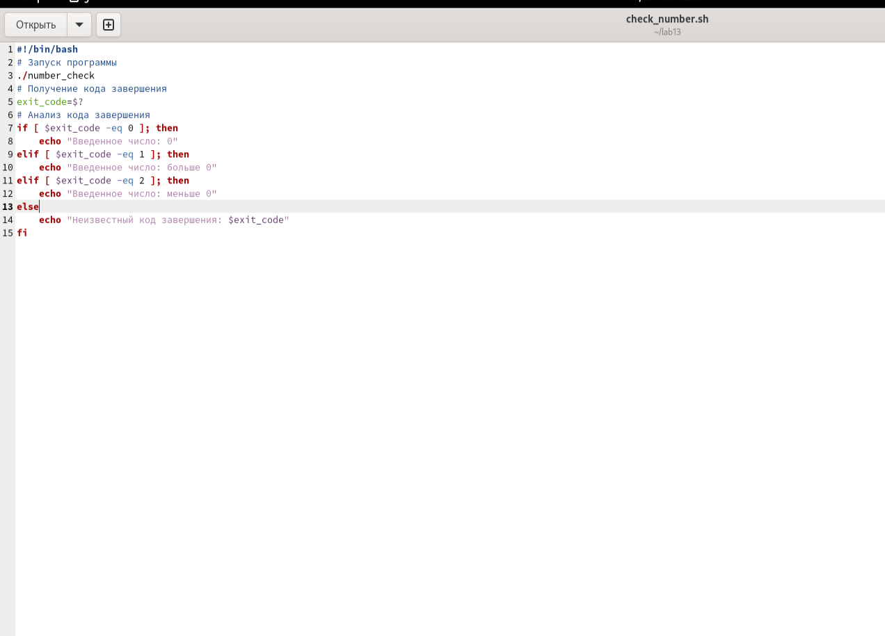
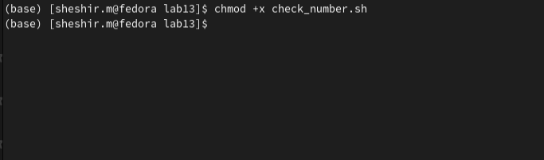
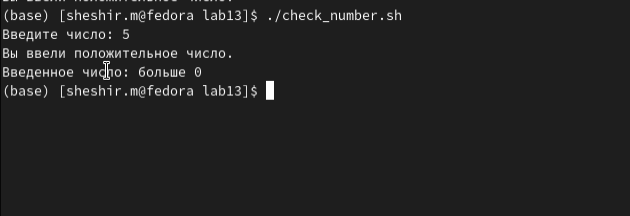

---
## Front matter
lang: ru-RU
title: Структура научной презентации
subtitle: Презентация лабораторной работы № 13
author:
  - Ахмад Мд Шешир.
institute:
  - Российский университет дружбы народов, Москва, Россия
date: 

## i18n babel
babel-lang: russian
babel-otherlangs: english

## Formatting pdf
toc: false
toc-title: Содержание
slide_level: 2
aspectratio: 169
section-titles: true
theme: metropolis
header-includes:
 - \metroset{progressbar=frametitle,sectionpage=progressbar,numbering=fraction}
---

## Докладчик

:::::::::::::: {.columns align=center}
::: {.column width="70%"}

  * Ахмад Мд Шешир
  * Cтудент
  * Российский университет дружбы народов

:::
::: {.column width="30%"}

# Цель работы

::: incremental

Изучить основы программирования в оболочке ОС UNIX/Linux. Научиться писать небольшие командные файлы.

:::

## Выполнение лабораторной работы 12

**1**. Написать на языке Си программу, которая вводит число и определяет, является ли оно
больше нуля, меньше нуля или равно нулю. Затем программа завершается с помощью
функции exit(n), передавая информацию в о коде завершения в оболочку. Командный файл должен вызывать эту программу и, проанализировав с помощью команды
"$?", выдать сообщение о том, какое число было введено.

::: incremental

## 1

Открываю текстовый редактор и создаю новый файл для кода на С 

{}

:::

## 2

::: incremental

Программа запрашивает у пользователя ввод числа, определяет является ли оно положительным отрицательным или равным нулю, а затем завершает работу.

{}

:::

## 3 

::: incremental

Создаю исполняемый файл, выполнив команду в терминале gcc для языка С 

{}

:::

## 4

::: incremental

Создаю новый файл для кода для BASH и набираю программу 

{}

:::

## 5

::: incremental

Делаю файл исполняемым, выполнив команду в терминале chmod 

{}

:::

## 6

::: incremental

Запускаю исполняемы файл, и пишу любое число 5, все работает

{}

:::

## вывод

::: incremental

В ходе работы я изучил основы программирования в оболочке ОС UNIX/Linux. Научился писать небольшие командные файлы.

:::

