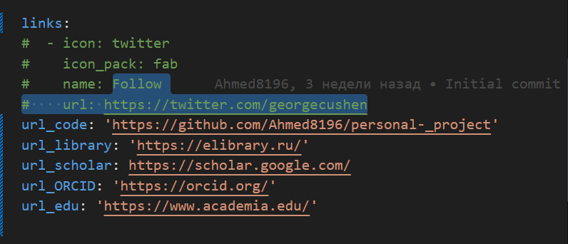
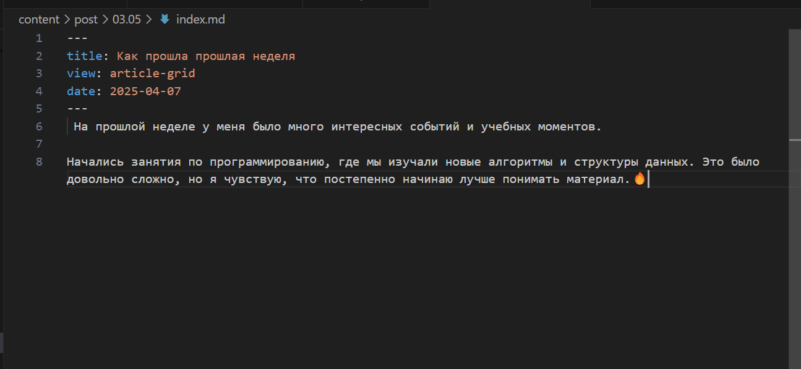
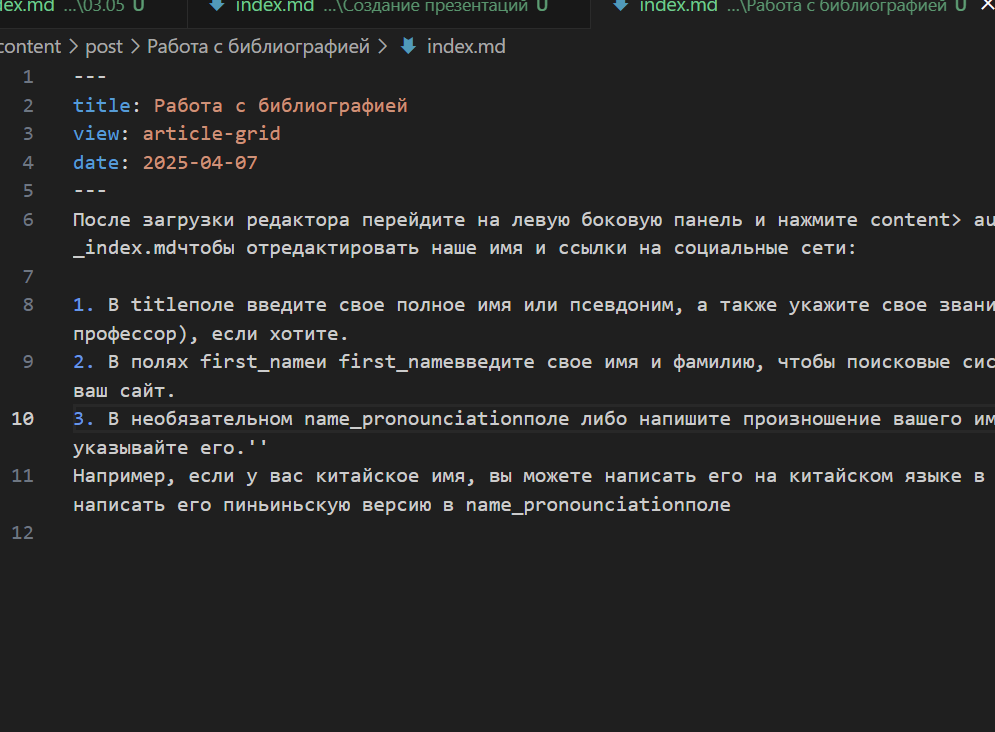
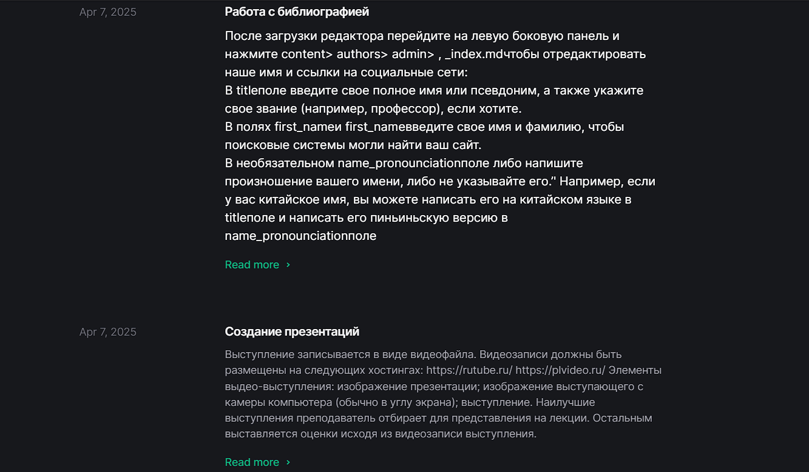

---
## Front matter
lang: ru-RU
title: Структура научной презентации
subtitle: Презентация по индивидуальному проекту № 4
author:
  - Ахмад Мд Шешир.
institute:
  - Российский университет дружбы народов, Москва, Россия
date: 

## i18n babel
babel-lang: russian
babel-otherlangs: english

## Formatting pdf
toc: false
toc-title: Содержание
slide_level: 2
aspectratio: 169
section-titles: true
theme: metropolis
header-includes:
 - \metroset{progressbar=frametitle,sectionpage=progressbar,numbering=fraction}
---

## Докладчик

:::::::::::::: {.columns align=center}
::: {.column width="70%"}

  * Ахмад Мд Шешир
  * Cтудент
  * Российский университет дружбы народов

:::
::: {.column width="30%"}

# Цель работы

::: incremental

Добавить к сайту ссылки на свои ресурсы и создать нужные посты.

:::

## Выполнение лабораторной работы 8

::: incremental

Зарегистрировался на соответствующих ресурсах и разместил на них ссылки на сайте:
eLibrary : https://elibrary.ru/;
Google Scholar : https://scholar.google.com/;
ORCID : https://orcid.org/;
Mendeley : https://www.mendeley.com/;
ResearchGate : https://www.researchgate.net/;
Academia.edu : https://www.academia.edu/;
arXiv : https://arxiv.org/;
github : https://github.com/.

:::

## 2 вывод имен в файл

::: incremental

 Делаю пост по прошедшей неделе

:::

## 3 определение файлов в катологе

::: incremental

Делаю пост на тему "Работа с библиографией"

:::

## 4 фоновый режим

::: incremental

Проверяю работу, запускаю сайте.

:::

## 5 Определение идентификатора

::: incremental

Запустил в фоновом режиме процесс, который будет записывать в файл ~/logfile файлы, имена которых начинаются с log.

:::

## вывод

::: incremental

Входе лабораторной работы я получил навыки редактирование инфорамации на сайте.

 
:::

